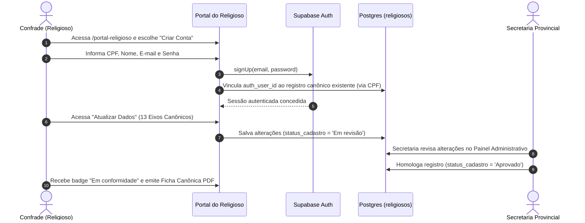
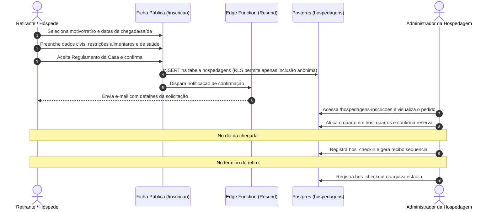
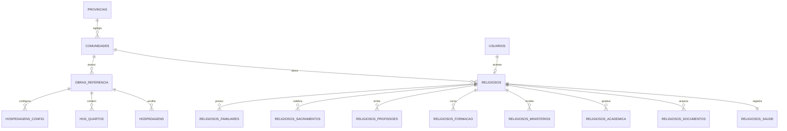

# DIRETRIZES ARQUITETURAIS DO SISTEMA INTEGRADO — PROVÍNCIA BRM (DEHONIANOS)
**Documento Mestre de Engenharia de Software, Produto e Governança**

* **Organização Mantenedora:** Província Brasil Meridional dos Padres do Sagrado Coração de Jesus (Dehonianos)
* **Sede Provincial:** Curitiba/PR | **Centro de Acolhida & Convento Histórico:** Taubaté/SP
* **Status Atual do Projeto:** ~30% Concluído (Fase de Estabilização, Segurança e Expansão)
* **Versão das Diretrizes:** 2.0.0
* **Data:** 25/09/2026

---

## ÍNDICE GERAL
1. [PRD — Product Requirements Document](#1-prd--product-requirements-document)
2. [TRD — Technical Requirements Document](#2-trd--technical-requirements-document)
3. [Fluxo do App & Arquitetura da Informação](#3-fluxo-do-app--arquitetura-da-informação)
4. [Diretrizes de UI/UX Design & Design System](#4-diretrizes-de-uiux-design--design-system)
5. [Esquema de Backend, Modelagem de Dados & RLS](#5-esquema-de-backend-modelagem-de-dados--rls)
6. [Plano de Implementação (Roadmap 30% ➔ 100%)](#6-plano-de-implementação-roadmap-30--100)

---

# 1. PRD — Product Requirements Document

### 1.1. Visão do Produto & Missão Institucional
O **Sistema Integrado BRM** é a plataforma SaaS unificada da Província Brasil Meridional da Congregação dos Padres do Sagrado Coração de Jesus (Dehonianos). O sistema tem como missão:
1. **Governança Canônica & Administrativa:** Centralizar o arquivo histórico, registros sacramentais, vida consagrada, etapas formativas, transferências e histórico ministerial de todos os confrades (bispos, padres, diáconos, irmãos e religiosos em formação).
2. **Vida Comunitária & Confraternização:** Oferecer aos religiosos uma área de autoatendimento ("Portal do Religioso / Portal do Confrade") moderna, fluida e acessível para consulta de anuário, atualização de dados, agenda provincial e solicitações fraternas.
3. **Gestão Operacional de Hospedagem & Casas de Retiro:** Administrar a ocupação de quartos, reservas para cursos/retiros e acolhida de hóspedes na sede do Conventinho de Taubaté e demais casas aptas à hospitalidade da Província.
4. **Patrimônio & Presença Pastoral:** Gerenciar o catálogo geoespacial e institucional de todas as Paróquias, Casas de Formação, Colégios e Obras Sociais sob tutela dehoniana nos estados de atuação da Província (SC, PR, SP, RJ, etc.).

---

### 1.2. Personas & Perfis de Usuário (RBAC)

| Perfil / Persona | Descrição | Principais Necessidades |
|---|---|---|
| **Administrador Provincial (Sede Provincial / Superior Provincial)** | Gestor máximo da Província | Visualizar dashboard geral, indicadores canônicos, aprovar novos cadastros de religiosos, gerenciar acessos e auditar o sistema. |
| **Secretaria Provincial** | Operadores do arquivo e expediente | Homologar fichas cadastrais enviadas, anexar decretos/provisões em PDF, extrair anuários e emitir certidões canônicas oficiais. |
| **Superior Local / Pároco / Diretor de Obra** | Responsável por uma comunidade ou paróquia | Atualizar dados da sua casa/obra via link seguro ou painel, gerenciar religiosos alocados em sua fraternidade. |
| **Religioso / Confrade (Membro)** | Sacerdote, diácono, irmão ou fráter dehoniano | Acessar o Portal do Confrade (via CPF/senha), manter sua ficha de 13 etapas atualizada, consultar anuário com contatos dos irmãos e solicitar hospedagem. |
| **Gestor da Hospedagem / Acolhida (Casas da Província BRM)** | Administrador das acomodações e retiros | Gerenciar quartos, aprovar inscrições de hóspedes, realizar check-in/check-out e emitir recibos financeiros de diárias. |
| **Hóspede Externo (Visitante / Retirante)** | Público em geral ou seminarista de passagem | Preencher formulário público de inscrição de estadia em etapas claras, aceitar regulamento e receber comprovante por e-mail. |

---

### 1.3. Módulos do Sistema e Requisitos Funcionais

#### Módulo A: Sistema Administrativo (Sede Provincial & Secretaria)
* **RF-A01 (Dashboard Provincial):** Painel unificado com KPIs de presença pastoral, pirâmide etária da Província, distribuição por grau canônico (Padres, Fráteres, Irmãos, Diáconos, Bispos) e ocupação das casas de acolhida.
* **RF-A02 (Gestão Completa de Religiosos):** Tabela administrativa com filtros avançados, visualização detalhada em 13 eixos canônicos, workflow de aprovação ("Em revisão" ➔ "Aprovado" ➔ "Arquivado") e controle de status de vida ("Ativo", "Em missão", "Estudos", "Emérito", "Falecido", "Exclaustrado").
* **RF-A03 (Gestão de Obras & Paróquias):** Cadastro completo com geolocalização, diocese de jurisdição, data de fundação, data de assunção pelos dehonianos, contatos e geração de token seguro para atualização descentralizada.
* **RF-A04 (Importador/Exportador em Lote):** Suporte à importação e higienização de planilhas Excel/CSV (como o arquivo institucional de paróquias) com normalização de datas, siglas de UF e cidades.
* **RF-A05 (Gestão de Usuários & Perfis):** Atribuição de permissões granulares baseadas em arrays de claims (`admin`, `secretaria`, `hospedaria`, `religioso`).

#### Módulo B: Portal do Religioso (Portal do Confrade)
* **RF-B01 (Autenticação Descomplicada):** Login duplo utilizando CPF (com máscara automática) ou E-mail institucional + Senha criptografada.
* **RF-B02 (Autoatendimento em 13 Etapas):**
  1. Identificação Civil & Documental (RG, CPF, Título, PIS, CNH, Passaporte)
  2. Dados Familiares & Contatos de Emergência
  3. Sacramentos de Iniciação Cristã (Batismo, Eucaristia, Crisma com Livro/Folha/Registro)
  4. Histórico Vocacional & Paróquia de Origem
  5. Etapas de Formação Religiosa (Seminário Menor, Propedêutico, Postulantado, Noviciado)
  6. Profissões Religiosas & Votos (Primeira Profissão, Renovações, Perpétua)
  7. Ministérios & Ordens Sacras (Leitorado, Acolitado, Diaconato, Presbiterado, Episcopado)
  8. Formação Acadêmica & Superior (Filosofia, Teologia, Pós-graduações, Mestrados)
  9. Idiomas & Competências Especiais
  10. Histórico de Comunidades & Nomeações
  11. Missões & Serviços Especiais (CNBB, Dioceses, Cargos Externos)
  12. Endereço e Contatos Atuais
  13. Histórico de Saúde & Convênios (Tipo sanguíneo, Alergias, Contato de Emergência, SUS/Plano privado)
* **RF-B03 (Emissão da Ficha Canônica Oficial em PDF):** Geração imediata no padrão litúrgico/canônico para impressão em tamanho A4 com brasão oficial da Província.
* **RF-B04 (Anuário Digital BRM):** Diretório pesquisável de todos os confrades vivos e ativos, aniversariantes do mês e lista de fraternidades por cidade/estado.
* **RF-B05 (Rascunho Automático / Autosave):** Armazenamento em `localStorage` para que o religioso não perca seu preenchimento caso caia a conexão.

#### Módulo C: Módulo de Hospedagem & Acolhida (Conventinho)
* **RF-C01 (Inscrição Pública Multi-obra):** Página pública responsiva acessível por link direto (`/inscricao` ou `/inscricao/:slugObra`) com esteira guiada em 6 etapas:
  1. Identificação do Evento / Motivo da Estadia
  2. Dados Pessoais & Documento
  3. Endereço de Procedência
  4. Saúde, Alergias & Restrições Alimentares
  5. Previsão de Chegada e Saída
  6. Dados para Recibo, Termos de Aceite & Regulamento
* **RF-C02 (Gestão de Acomodações & Quartos):** Mapa de quartos por ala/bloco, capacidade de leitos e status em tempo real (Disponível, Ocupado, Manutenção, Reservado).
* **RF-C03 (Check-in & Check-out):** Registro das datas e horas efetivas de entrada e saída com atribuição de quarto.
* **RF-C04 (Emissão de Recibos & Notificação):** Geração de recibos com numeração sequencial e disparo de e-mail automático com os detalhes da acolhida.

---

### 1.4. Requisitos Não-Funcionais (RNF)
* **RNF-01 (Segurança & LGPD):** Dados de saúde e dados sacramentais/familiares são dados sensíveis. O sistema deve aplicar Row Level Security (RLS) estrito, proibindo leituras anônimas de tabelas que contenham CPFs, endereços ou restrições médicas.
* **RNF-02 (Segregação de Credenciais):** Proibição absoluta de armazenamento de senhas SMTP ou tokens de terceiros em colunas expostas publicamente.
* **RNF-03 (Performance & Core Web Vitals):** Carregamento do First Contentful Paint (FCP) abaixo de 1.2s através de code-splitting via `React.lazy` e Vite.
* **RNF-04 (Acessibilidade & Usabilidade - WCAG 2.2 AA):** Contraste mínimo de 4.5:1 para textos, suporte completo a leitores de tela (`aria-labels`, inputs vinculados via `id`/`htmlFor`) e preenchimento otimizado em dispositivos móveis (`inputMode="numeric"`, `autoComplete`).
* **RNF-05 (Compatibilidade & Resiliência):** Aplicação SPA tolerante a falhas com `ErrorBoundary` e suporte completo aos modos Dark e Light.

---

# 2. TRD — Technical Requirements Document

### 2.1. Arquitetura da Stack Tecnológica
```
                                ┌──────────────────────────────────────────────┐
                                │              Camada de Cliente               │
                                │  - React 19.x + TypeScript 6.x               │
                                │  - Vite 8.x + Tailwind CSS v4                │
                                │  - Lucide Icons + DOMPurify + SheetJS (XLSX) │
                                └──────────────────────┬───────────────────────┘
                                                       │ HTTPS / WSS
                                                       ▼
                                ┌──────────────────────────────────────────────┐
                                │             Supabase Cloud (PaaS)            │
                                ├──────────────────────────────────────────────┤
                                │ 1. GoTrue Auth (JWT com Custom User Claims)  │
                                │ 2. PostgREST API (Camada REST com RLS Ativo) │
                                │ 3. PostgreSQL 15+ (Schema Normalizado & PII) │
                                │ 4. Storage Buckets (Documentos Canônicos)    │
                                │ 5. Edge Functions (Deno / E-mails & Webhooks)│
                                └──────────────────────────────────────────────┘
```

---

### 2.2. Remediações Críticas de Segurança (Security Hardening)
Com base na auditoria recente de vulnerabilidades (`docs/auditoria-inscricao-publica.md`), as seguintes correções são mandatórias na arquitetura:

1. **Eliminação do Vazamento SMTP:**
   * **Situação Atual:** A tabela `mainhospedagem` armazenava login e senha SMTP que eram consultados via `select('*')` anônimo no frontend.
   * **Solução Arquitetural:** As credenciais SMTP foram completamente removidas do banco de dados. O envio de e-mails transacionais (comprovante de inscrição de hóspede e homologação de religioso) passa a ser executado exclusivamente por uma **Supabase Edge Function** (`send-email-notification`), consumindo credenciais armazenadas nos *Secrets* protegidos do Supabase (ex: Resend API Key ou SMTP seguro).
2. **Revisão Rigorosa de Row Level Security (RLS):**
   * Tabela `hospedagens`: O perfil `anon` tem permissão **única de INSERT**. Permissões de `SELECT`, `UPDATE` e `DELETE` são restritas a usuários autenticados com o claim de `hospedaria` ou `admin`.
   * Tabela `religiosos`: Acesso público restrito a INSERT via formulário avulso ou vinculado ao próprio `auth_user_id`. Sede Provincial e Secretaria têm permissão total de homologação.
   * Tabela `religiosos_documentos`: Arquivos no bucket do Supabase Storage protegidos por políticas que exigem token de autenticação correspondente ao ID do religioso ou role administrativo.

---

### 2.3. Integrações de Terceiros & APIs
* **ViaCEP API:** Autocompletar logradouro, bairro, município e UF no preenchimento de endereço pessoal e paroquial.
* **Provedor de E-mail Transacional (Resend / AWS SES / Postmark via Edge Function):** Disparo de confirmação de estadia para o retirante e notificação à Secretaria Provincial.
* **Processamento de Planilhas (SheetJS / xlsx):** Importação em lote da base histórica de paróquias e comunidades.

---

# 3. Fluxo do App & Arquitetura da Informação

### 3.1. Mapa Geral de Navegação
```
[ Início Público / Acessos Externos ]
  ├── /login ───────────────────────────> Login Administrativo (Sede Provincial / Secretaria)
  ├── /portal-religioso ────────────────> Login ou Auto-cadastro do Membro (CPF/Senha)
  ├── /inscricao ───────────────────────> Ficha Pública de Hospedagem (Casas da Província BRM)
  ├── /cadastro-religiosos ─────────────> Ficha Pública Avulsa de Religioso (13 passos)
  └── /atualizar-obra/:token ───────────> Link Mágico para Párocos/Reitores

[ Painel Administrativo da Sede Provincial (Protegido - Roles: admin, usuarios, hospedaria) ]
  ├── /inicio ──────────────────────────> Dashboard Provincial com Gráficos e Alertas
  ├── /religiosos ──────────────────────> Tabela Geral e Homologação de Membros
  │     ├── /religiosos/novo ───────────> Cadastro Interno de Confrade
  │     └── /religiosos/editar/:id ─────> Edição Canônica em 13 Etapas
  ├── /obras ───────────────────────────> Catálogo de Obras, Paróquias e Casas
  │     ├── /obras/nova ────────────────> Nova Unidade Pastoral
  │     └── /obras/editar/:id ──────────> Edição de Histórico, Diocese e Contatos
  ├── /hospedagens-inscricoes ──────────> Gestão de Reservas, Hóspedes e Quartos
  ├── /hospedagens-configuracoes ───────> Textos de Acolhida, Regulamento e Vagas
  ├── /estatisticas-brm ────────────────> Gráficos Demográficos, Jubileus e Pirâmide
  └── /usuarios ────────────────────────> Gestão de Permissões e Operadores da Sede Provincial

[ Portal do Religioso / Confrade (Protegido - Role: religioso) ]
  ├── Tab: Início / Resumo ─────────────> Saudação, Status de Validação e Agenda
  ├── Tab: Meu Perfil ──────────────────> Foto de perfil e dados de contato rápidos
  ├── Tab: Atualizar Dados ─────────────> Ficha Canônica Integral de 13 Etapas
  ├── Tab: Minha Ficha PDF ─────────────> Emissão da Ficha Canônica Oficial A4
  ├── Tab: Anuário BRM ─────────────────> Lista telefônica/e-mail dos confrades
  ├── Tab: Calendário ──────────────────> Agenda Provincial e Retiros do Ano
  └── Tab: Pedir Hospedagem ────────────> Solicitação de Estadia no Convento
```

---

### 3.2. Fluxo 1: Onboarding e Atualização do Religioso


---

### 3.3. Fluxo 2: Inscrição Pública de Hospedagem & Check-in


---

# 4. Diretrizes de UI/UX Design & Design System

### 4.1. Fundamentos Visuais & Identidade BRM
O design une a sobriedade institucional da Igreja com a elegância de acabamento do padrão Apple/SaaS moderno.
* **Cores Principais:**
  * `Primary Navy`: `#0c3a4a` (Profundidade institucional, solidez, cabeçalhos)
  * `Deep Navy`: `#0a2e3b` (Bases nobres, rodapés e modais de alto contraste)
  * `Teal Sacred`: `#125566` e `#14b8a6` (Destaques, botões de ação e estados ativos)
  * `Accent Apple Blue`: `#0071e3` / Dark `#2997ff` (Ações nos portais de autoatendimento)
  * `Surface Canvas`: `#f5f5f7` (Light) e `#000000` / `#161617` (Dark Cupertino)
* **Tipografia Hierárquica:**
  * **Headings e Solenidades:** `Cinzel`, serifada romana clássica, aplicada a títulos canônicos e certificados.
  * **Interface e Legibilidade:** `General Sans` ou `SF Pro Display / Text`, sem serifa, limpa, espaçamento de tracking `-0.02em` em títulos e altura de linha `1.5` em textos.
* **Superfícies & Efeitos:**
  * Uso de *Frosted Glass* (`backdrop-blur-xl bg-white/80 dark:bg-[#161617]/80`).
  * Bordas sutis de alta definição (`border border-[#d6d6d6]/60 dark:border-white/10`).
  * Raios de curvatura modernos: Cards em `24px` a `28px`, botões em *pill shape* (`rounded-full`).

---

### 4.2. Padronização de Componentes Críticos

#### Stepper Progressivo de 13 Etapas (Cadastro do Religioso)
* **Desktop:** Indicador com numeração de 01 a 13, linha de conexão com preenchimento gradativo e identificador visual da etapa concluída (`CheckCircle2`).
* **Mobile:** Barra de progresso contínua com contador `Etapa X de 13` e títulos recolhíveis para garantir ergonomia de toque em telas menores que 400px.
* **Persistência de Rascunho:** Aviso sutil de que os dados são salvos localmente a cada campo preenchido.

#### Card de Persona e Menu Dropdown (SaaS Pattern)
* Avatar com foto oficial ou iniciais eclesiásticas do confrade.
* Exibição clara do grau (`Padre`, `Fráter`, `Irmão`, etc.) e comunidade de alocação.
* Dropdown flutuante com ações rápidas: Edição de dados, emissão de PDF e encerramento de sessão.

---

# 5. Esquema de Backend, Modelagem de Dados & RLS

### 5.1. Diagrama Entidade-Relacionamento (ERD)


---

### 5.2. Especificação das Tabelas Principais (DDL Consolidado)

```sql
-- 1. EXTENSÕES & SEGURANÇA
create extension if not exists "pgcrypto";

-- 2. PARÓQUIAS, CASAS E OBRAS DA PROVÍNCIA
create table if not exists public.religiosos_obras_referencia (
  id uuid primary key default gen_random_uuid(),
  nome text not null,
  tipo text not null default 'Paróquia' check (tipo in ('Paróquia', 'Casa', 'Obra')),
  diocese text,
  localidade text,
  cidade text,
  uf text,
  endereco text,
  cep text,
  telefone text,
  email text,
  whatsapp text,
  fundacao date,
  assumida_pelos_dehonianos date,
  historia text,
  resumo_historico text,
  fotos jsonb default '[]'::jsonb,
  status_historia text default 'Pendente' check (status_historia in ('Pendente', 'Em análise', 'Aprovada')),
  token_edicao text unique,
  status text not null default 'Ativa' check (status in ('Ativa', 'Inativa')),
  created_at timestamptz not null default now(),
  updated_at timestamptz not null default now()
);

-- 3. NÚCLEO DOS RELIGIOSOS (CANÔNICO & CIVIL)
create table if not exists public.religiosos (
  id uuid primary key default gen_random_uuid(),
  auth_user_id uuid unique,
  origem_cadastro text not null default 'admin' check (origem_cadastro in ('admin', 'publico')),
  status_cadastro text not null default 'Em revisão' check (status_cadastro in ('Em revisão', 'Aprovado', 'Arquivado')),
  status text not null default 'Ativo' check (status in ('Ativo', 'Em missão externa', 'Em estudos', 'Emérito', 'Falecido', 'Exclaustrado')),
  grau text not null check (grau in ('Frater', 'Irmão', 'Diácono', 'Padre', 'Bispo')),
  nome_civil text not null,
  nome_religioso text,
  foto_url text,
  data_nascimento date,
  local_nascimento text,
  municipio_nascimento text,
  estado_nascimento text,
  pais_nascimento text default 'Brasil',
  nacionalidade text default 'Brasileira',
  cpf text unique,
  rg text,
  rg_orgao_expedidor text,
  rg_data_emissao date,
  titulo_eleitor text,
  pis text,
  cnh text,
  cnh_categoria text,
  passaporte text,
  comunidade_atual_nome text,
  obra_atual_id uuid references public.religiosos_obras_referencia(id) on delete set null,
  email_institucional text,
  email_pessoal text,
  telefone_celular text,
  whatsapp text,
  redes_sociais text,
  consentimento_dados boolean not null default false,
  consentimento_em timestamptz,
  created_at timestamptz not null default now(),
  updated_at timestamptz not null default now()
);

-- 4. DADOS DE SAÚDE (DADO SENSÍVEL - LGPD)
create table if not exists public.religiosos_saude (
  id uuid primary key default gen_random_uuid(),
  religioso_id uuid not null unique references public.religiosos(id) on delete cascade,
  plano_saude text,
  numero_plano_saude text,
  local_plano_saude text,
  sus text,
  tipo_sanguineo text,
  fator_rh text check (fator_rh in ('Positivo', 'Negativo', '+', '-', 'Não informado')),
  alergias text,
  medicamentos_continuos text,
  medico_responsavel text,
  contato_emergencia text,
  informacoes_clinicas text,
  cirurgias text,
  proteses text,
  observacoes text,
  created_at timestamptz not null default now(),
  updated_at timestamptz not null default now()
);

-- 5. ACOMODAÇÕES / QUARTOS DA HOSPEDARIA
create table if not exists public.hos_quartos (
  idhos_quartos uuid primary key default gen_random_uuid(),
  obra_id uuid references public.religiosos_obras_referencia(id) on delete cascade,
  hos_qua_nome text not null,
  hos_qua_descricao text,
  hos_qua_ala text,
  hos_qua_capacidade integer default 1,
  hos_qua_status text not null default 'Ativo' check (hos_qua_status in ('Ativo', 'Inativo', 'Manutenção')),
  created_at timestamptz not null default now()
);

-- 6. INSCRIÇÕES E ESTADIAS DE HOSPEDAGEM
create table if not exists public.hospedagens (
  idhospedagens uuid primary key default gen_random_uuid(),
  obra_id uuid references public.religiosos_obras_referencia(id) on delete set null,
  hos_categoria text,
  hos_nome text not null,
  hos_nascimento date,
  hos_cpfrg text,
  hos_email text,
  hos_telefone text,
  hos_telefoneemergencia text,
  hos_logradouro text,
  hos_numero text,
  hos_cep text,
  hos_bairro text,
  hos_cidade text,
  hos_estado text,
  hos_alergico text,
  hos_especifiquealergia text,
  hos_restricaoalimentar text,
  hos_especifiquerestricao text,
  hos_estadiamotivo text,
  hos_previsaochegada date,
  hos_previsaosaida date,
  hos_quarto uuid references public.hos_quartos(idhos_quartos) on delete set null,
  hos_checkin timestamptz,
  hos_checkout timestamptz,
  hos_recibo text,
  hos_recnome text,
  hos_reccpfcnpj text,
  hos_status text not null default 'Pendente' check (hos_status in ('Pendente', 'Confirmada', 'Check-in', 'Check-out', 'Cancelada')),
  hos_inscricao timestamptz not null default now(),
  created_at timestamptz not null default now()
);
```

---

### 5.3. Políticas de Segurança (Row Level Security - RLS)

```sql
-- HABILITAR RLS NAS TABELAS
alter table public.religiosos enable row level security;
alter table public.religiosos_saude enable row level security;
alter table public.hospedagens enable row level security;
alter table public.religiosos_obras_referencia enable row level security;

-- POLÍTICAS PARA HOSPEDAGENS (CORREÇÃO DA BRECHA PÚBLICA)
-- 1. Qualquer pessoa anônima pode se inscrever (INSERT)
create policy "Anon pode registrar inscricao"
  on public.hospedagens for insert
  to anon, authenticated
  with check (true);

-- 2. Apenas a equipe autenticada de Hospedaria/Sede Provincial pode ver todas as fichas (SELECT)
create policy "Staff autenticado pode ver hospedagens"
  on public.hospedagens for select
  to authenticated
  using (
    auth.jwt() ->> 'email' is not null
  );

-- 3. Apenas Staff pode alterar quarto, check-in e check-out (UPDATE)
create policy "Staff autenticado pode atualizar hospedagens"
  on public.hospedagens for update
  to authenticated
  using (true)
  with check (true);

-- POLÍTICAS PARA RELIGIOSOS
-- 1. Confrade pode visualizar e alterar apenas o seu próprio registro
create policy "Confrade gerencia seu proprio perfil"
  on public.religiosos for all
  to authenticated
  using (
    auth.uid() = auth_user_id
    or exists (
      select 1 from public.usuarios u 
      where u.auth_user_id = auth.uid() 
      and (u.usu_acessos::text like '%admin%' or u.usu_acessos::text like '%secretaria%')
    )
  );

-- 2. Leitura do anuário (dados públicos dos confrades ativos) por usuários autenticados
create policy "Confrades logados podem consultar anuario"
  on public.religiosos for select
  to authenticated
  using (status = 'Ativo');
```

---

# 6. Plano de Implementação (Roadmap 30% ➔ 100%)

### 6.1. Diagnóstico do Estado Atual (Os 30% Construídos)
* **Concluído e Funcional:**
  * Estruturação inicial do frontend React 19 com Tailwind CSS e Vite.
  * Cadastro de Religiosos em 13 etapas criado no frontend (`CadastroReligiosoPublico.tsx`).
  * Painel do Confrade moderno estilizado no padrão Apple (`PortalReligioso.tsx`).
  * Tabela de Obras e Paróquias com suporte a importação de Excel/XLSX (`ObrasAdmin.tsx`).
  * Visualizador e gerador preliminar da Ficha Canônica em PDF.
* **Lacunas e Pendências Identificadas:**
  * Falhas de RLS no Supabase permitindo leitura anônima de dados de saúde e estadias.
  * Credenciais SMTP em banco de dados precisando de desacoplamento via Edge Function.
  * Ausência de módulo automatizado de conciliação de quartos na hospedagem.
  * Validações estritas de datas (chegada posterior à saída) e máscaras de campos na inscrição pública.
  * Workflow de homologação e auditoria de alterações enviadas pelos confrades.

---

### 6.2. Fases de Execução & Milestones

```
  [ Fase 1: Segurança & Blindagem ] (Semana 1)
         │  - Migração de senhas SMTP para Secrets
         │  - Ativação de RLS estrito em todas as tabelas
         │  - Correção de validações de formulário (datas e CPF)
         ▼
  [ Fase 2: Gestão da Hospedagem 100% ] (Semana 2)
         │  - Gestão visual de quartos (grid de ocupação)
         │  - Edge Function de confirmação por e-mail (Resend)
         │  - Geração de recibos sequenciais em PDF
         ▼
  [ Fase 3: Portal do Religioso & Workflow Canônico ] (Semana 3)
         │  - Refinamento do autoatendimento de 13 passos com autosave
         │  - Fila de homologação na Secretaria Provincial
         │  - Anuário digital com aniversariantes e histórico
         ▼
  [ Fase 4: Obras, Paróquias & Link Mágico ] (Semana 4)
         │  - Validação da base completa de paróquias
         │  - Atualização descentralizada pelo pároco via token
         │  - Mapa geográfico e relatórios institucionais
         ▼
  [ Fase 5: Homologação, Carga de Dados & Go-Live ] (Semana 5)
            - Testes ponta a ponta (E2E)
            - Treinamento da Secretaria e Sede Provincial
            - Deploy em ambiente de produção oficial
```

---

### 6.3. Detalhamento dos Sprints de Entrega

#### Sprint 1: Blindagem de Segurança, LGPD & RLS
* Aplicar os scripts SQL de RLS restrito no Supabase.
* Configurar Supabase Edge Function `send-email-notification` e eliminar colunas de credenciais SMTP da tabela `mainhospedagem`.
* Implementar validação retroativa de datas (data de saída > data de chegada) e sanitização dos campos na página pública `/inscricao`.

#### Sprint 2: Módulo Completo de Hospedagem & Acolhida
* Desenvolver componente de mapa visual de leitos por ala/quarto no Conventinho.
* Criar fluxo ágil de Check-in e Check-out com 1 clique no painel administrativo.
* Implementar impressão e envio digital do comprovante de estadia.

#### Sprint 3: Portal do Religioso & Secretaria Provincial
* Integrar o preenchimento das 13 etapas com upload seguro de documentos canônicos (decretos, certidões) para o Supabase Storage.
* Finalizar a Ficha Canônica em PDF em alta resolução compatível com os padrões de arquivo do Vaticano e da Província.
* Adicionar painel de moderação para que a Secretaria compare o dado anterior com a alteração solicitada pelo religioso antes de homologar.

#### Sprint 4: Obras, Casas de Formação & Anuário
* Consolidar os dados da planilha `Paróquias e Obras - Site 2026.xlsx` no banco Supabase.
* Implementar o envio de links mágicos por WhatsApp/E-mail para que os superiores de cada casa mantenham fotos e histórico da paróquia atualizados.
* Habilitar busca por voz e filtros combinados no Anuário dos Confrades.

#### Sprint 5: Testes Integrados, Deploy & Treinamento
* Testes de carga e acessibilidade (WCAG 2.2 AA).
* Configuração do domínio institucional oficial (ex: `gestao.brm.org.br` / `portal.brm.org.br`).
* Elaboração de guia rápido ilustrado para os confrades mais idosos realizarem o recadastramento com facilidade.

---
*Documento aprovado para servir de base técnica e operacional para todo o ciclo de desenvolvimento do ecossistema BRM.*
